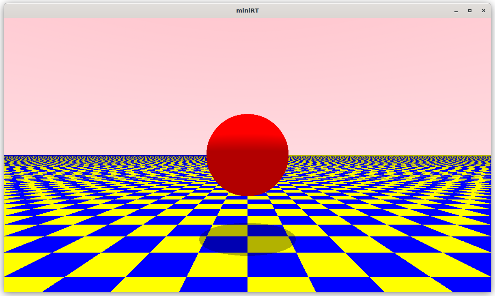
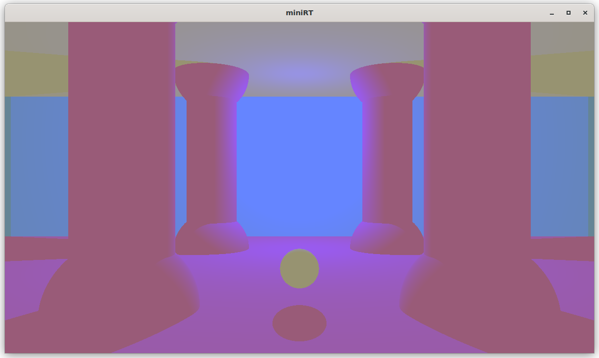

# 42MiniRT

This project is an introduction to Raytracing: a simulation of light and its interactions with physical objects with the help of mathematical formulas and the MLX42 graphics library.

Made by [pebencze](https://github.com/pebencze) and [vados-sa](https://github.com/vados-sa).

## Examples

## Useful links
* [MLX42 docs](https://github.com/codam-coding-college/MLX42/tree/master/docs)
* [geometry](https://www.scratchapixel.com/lessons/mathematics-physics-for-computer-graphics/geometry/points-vectors-and-normals.html)
* [checkerboards](http://raytracerchallenge.com/bonus/texture-mapping.html)
* [lighting](https://learnopengl.com/Lighting/Basic-Lighting)
* [Raytracing In One Weekend](https://raytracing.github.io/)
* [Fundamentals of Ray Tracing](http://cosinekitty.com/raytrace/raytrace_us.pdf)
* [the famous scratchapixel website to get started](https://www.scratchapixel.com/)

/**
 * @var oc: vector from the ray origin to a point on the plane
 * @var numerator: numerator of the function to calculate t
 * @var denominator: denominator of the function to calculate t
 * if the denominator is close to 0, the ray will be parallel to the plane, so
 * they either perfectly coincide, offering an infinite number of solutions,
 * or they do not intersect at all. If t is negative, the intersection happens
 * nbehind the ray origin, which we don't want to take into consideration.
 * If the ray is coming from the back side of the plane, we want to invert the normal.
 * @return value: t_intersection struct if there is an intersection, NULL if there is not
 * or if the intersection happens behind the camera.
 */
t_intersec	*plane_intersect(t_ray ray, t_object *obj)

/**
 * the larger θ becomes, the less of an impact
 * the light should have on the fragment's color.
 * to get (only) the cosine of the angle between
 * both vectors we will work with unit vectors (vectors of length 1)
 * so we need to make sure all the vectors are normalized
 * surface_normal: a vector that is perpendicular to the vertex' surface.
 * The directed light ray: a direction vector that is the difference vector
 * between the light's position and the fragment's position. To calculate this light
 * ray we need the light's position vector and the fragment's position vector.
 * @param l: a linked list of light sources
 * @param hit_rec: a t_intersection struct that contains the surface normal and the point where the object was hit
 */
t_color	diffuse_light(t_l *l, t_intersec *hit_rec, t_data *data)

/**
 * checkerboard based on the color of the object in the .rt file and
 * on its complementary color
 */
t_color	checkerboard(t_intersec *object)
